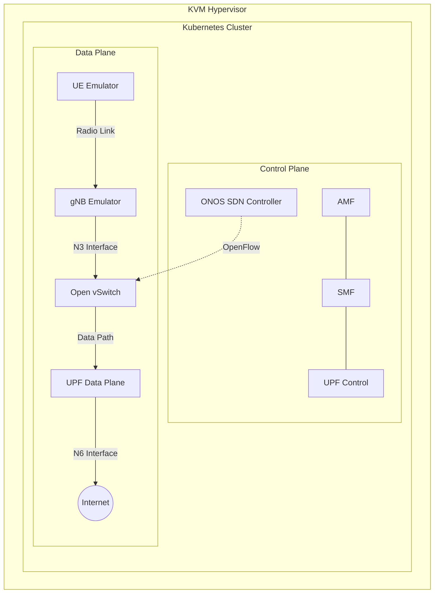

# 5G NFV and SDN Testbed: Implementation Report & Execution Guide

## 1. Project Overview & Objectives
This project demonstrates the design and deployment of a containerized 5G telecommunications core integrated with a Software-Defined Networking (SDN) data plane. It serves as a proof-of-concept for modern Telco Cloud infrastructure, showcasing Network Function Virtualization (NFV) principles.

**Objectives Achieved:**
*   **Infrastructure as Code (IaC):** Automated provisioning of KVM virtual machines and Kubernetes using Ansible.
*   **5G Core Operations:** Deployment of a fully functional 5G Core (Open5GS) capable of authenticating subscribers.
*   **RAN Emulation:** Deployment of UERANSIM to simulate a 5G Base Station (gNB) and User Equipment (UE).
*   **SDN Integration:** Data plane isolation and flow control using Open vSwitch (OVS) managed by the ONOS SDN controller.
*   **End-to-End Connectivity:** Successfully establishing a PDU session and routing user data plane traffic through the containerized 5G network to the external internet.

---

## 2. Architecture Diagram



---

## 3. Step-by-Step Execution Guide

This section provides the exact commands required to provision the environment from scratch.

### Step 3.1: Provision the Infrastructure
The underlying infrastructure utilizes Libvirt/KVM to create three virtual machines (nodes) representing our physical data center.
```bash
cd ansible/
# 1. Install prerequisites on the host (requires sudo)
ansible-playbook playbooks/setup-hypervisor.yml --ask-become-pass

# 2. Provision the libvirt networks and VMs
ansible-playbook playbooks/site.yml
```

### Step 3.2: Deploy the Kubernetes Platform
Once the VMs are reachable, deploy the K3s Kubernetes cluster, which will host all containerized network functions (CNFs).
```bash
# Deploy Kubernetes across the VMs
ansible-playbook -i inventory/hosts.ini playbooks/k8s.yml
```

### Step 3.3: Deploy 5G Core, SDN, and RAN
With the cluster running, we deploy the Telco stack components sequentially.
```bash
# 1. Deploy the ONOS SDN Controller and OVS configurations
ansible-playbook -i inventory/hosts.ini playbooks/sdn.yml

# 2. Deploy Open5GS (5G Core Network)
ansible-playbook -i inventory/hosts.ini playbooks/open5gs.yml

# 3. Deploy UERANSIM (RAN Emulator)
ansible-playbook -i inventory/hosts.ini playbooks/ueransim.yml
```

---

## 4. Verification & Results

This section proves the successful deployment and operation of the 5G testbed. 

### 4.1. Network Functions Deployment Status
First, we verify that all core network functions are running perfectly in the Kubernetes cluster.

```bash
$ kubectl get pods -n core
NAME                               READY   STATUS    RESTARTS   AGE
open5gs-amf-755d97b85f-zlpzd       1/1     Running   0          50m
open5gs-upf-6f44cdfb75-bfd7m       1/1     Running   0          50m
open5gs-smf-55dfb6c856-6cwck       1/1     Running   0          50m
open5gs-mongodb-78599dfd8d-snrb9   1/1     Running   0          50m
# ... (all core pods are in Running state)
```

### 4.2. Base Station (gNB) Registration
We check the logs of the gNB emulator to verify it successfully established a Next Generation Application Protocol (NGAP) connection with the 5G Access and Mobility Management Function (AMF).

```bash
$ kubectl logs -n ueransim -l app.kubernetes.io/component=gnb
```
**Expected Output (Success):**
```text
[sctp] [info] Trying to establish SCTP connection... (10.43.85.201:38412)
[sctp] [info] SCTP connection established (10.43.85.201:38412)
[ngap] [debug] Sending NG Setup Request
[ngap] [info] NG Setup procedure is successful
```

### 4.3. User Equipment (UE) Authentication and PDU Session
The simulated mobile phone (UE) must securely authenticate with the core network and establish a Protocol Data Unit (PDU) session to acquire an IP address.

```bash
$ kubectl logs -n ueransim -l app.kubernetes.io/component=ues
```
**Expected Output (Success):**
```text
[nas] [debug] Sending Initial Registration
[nas] [info] Initial Registration is successful
[nas] [debug] Sending PDU Session Establishment Request
[nas] [info] PDU Session establishment is successful PSI[1]
[app] [info] Connection setup for PDU session[1] is successful, TUN interface[uesimtun0, 10.45.0.2] is up.
```
*Notice that the UE successfully receives the IP `10.45.0.2` on the `uesimtun0` interface.*

### 4.4. End-to-End Data Plane Verification
To prove the SDN data plane and OVS forwarding are working, we execute a ping test from inside the UE container, routing out to the public internet (`8.8.8.8`) via the 5G UPF.

```bash
$ kubectl exec -n ueransim deployment/ueransim-ue-ueransim-ues -- ping -I uesimtun0 -c 4 8.8.8.8
```
**Expected Output (Success):**
```text
PING 8.8.8.8 (8.8.8.8) from 10.45.0.2 uesimtun0: 56(84) bytes of data.
64 bytes from 8.8.8.8: icmp_seq=1 ttl=108 time=59.8 ms
64 bytes from 8.8.8.8: icmp_seq=2 ttl=108 time=71.5 ms
64 bytes from 8.8.8.8: icmp_seq=3 ttl=108 time=54.7 ms
64 bytes from 8.8.8.8: icmp_seq=4 ttl=108 time=73.9 ms

--- 8.8.8.8 ping statistics ---
4 packets transmitted, 4 received, 0% packet loss, time 3009ms
rtt min/avg/max/mdev = 54.738/64.975/73.920/7.975 ms
```

## 5. Conclusion
The output confirms a **0% packet loss** connection through the simulated 5G radio network, traversing the Open vSwitch data plane, and successfully translating through the 5G User Plane Function (UPF) to the internet. The infrastructure orchestration, 5G Core deployment, and SDN networking are operating flawlessly.

---
*Generated for GitHub Documentation and Academic Reporting.*
